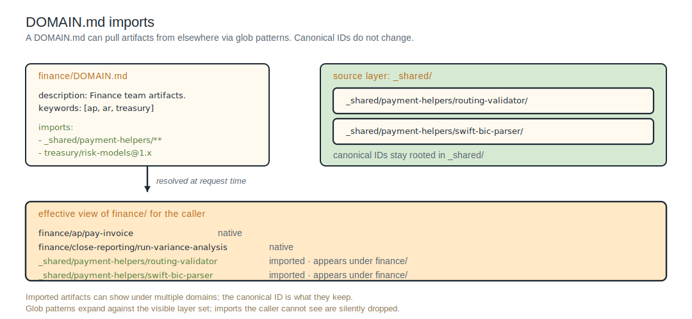

# Domains

A **domain** is a directory in the registry. It groups related artifacts and gives them shared context. `finance` is a top-level domain; `finance/ap` is a subdomain; `finance/ap/pay-invoice` is the canonical path of an artifact under it.

Domains exist whether or not you do anything special. Any subdirectory in your registry path is a domain by default. The optional `DOMAIN.md` file at the directory root adds metadata: a description, keywords, featured artifacts, the prose body that an agent reads when it navigates here, imports from elsewhere, and discovery-rendering knobs.

---

## When you don't need DOMAIN.md

For a small or in-progress catalog, nest folders. The directory tree is the domain hierarchy, and each artifact's canonical ID is the directory path under the registry root.

```
~/podium-artifacts/
└── personal/
    ├── hello/
    │   └── greet/                 # type: skill
    │       ├── SKILL.md
    │       └── ARTIFACT.md
    └── deploy/
        └── check-config/          # type: command
            └── ARTIFACT.md
```

`load_domain("personal")` returns the two subdomains; `load_domain("personal/hello")` returns the `greet` artifact. No `DOMAIN.md` needed.

---

## When to add one

Add a `DOMAIN.md` when:

- A description should appear in `load_domain` output.
- Keywords should surface in `search_domains`.
- Artifacts from another domain should appear in this domain.
- Some paths should be excluded from this domain.
- A folder should be unlisted, hidden from enumeration, and still reachable by ID.
- Discovery rendering needs subtree-specific overrides.

`DOMAIN.md` lives at the root of a domain directory:

```
~/podium-artifacts/
└── team-finance/
    └── finance/
        └── ap/
            ├── DOMAIN.md          ← the metadata file
            ├── pay-invoice/       # type: skill
            │   ├── SKILL.md
            │   └── ARTIFACT.md
            └── reconcile-invoice/ # type: skill
                ├── SKILL.md
                └── ARTIFACT.md
```

---

## DOMAIN.md schema

```markdown
---
unlisted: false
description: "AP-related operations"

discovery:
  max_depth: 4
  fold_below_artifacts: 5
  featured:
    - finance/ap/pay-invoice
  deprioritize:
    - finance/ap/_archive/**
  keywords:
    - invoice
    - remittance
    - reconciliation
    - 1099
    - vendor master

include:
  - finance/ap/pay-invoice
  - finance/ap/payments/*
  - finance/refunds/**
  - _shared/payment-helpers/*
  - _shared/regex/{ssn,iban,routing-number}

exclude:
  - finance/ap/internal/**
---

# Accounts Payable

Operations and artifacts for the AP function: invoice processing,
vendor remittance, payment reconciliation, and 1099 reporting. This
domain applies to tasks involving money flowing out of the company to
vendors.

For inbound payments and AR, see `finance/ar/`.
```

| Field | Description |
|:--|:--|
| `unlisted` | When `true`, the folder and its subtree are removed from `load_domain` enumeration. Artifacts inside are still reachable via `load_artifact`, still appear in `search_artifacts` (subject to per-artifact `search_visibility:`), and can be imported into other domains. Default `false`. |
| `description` | One-line summary used wherever this domain appears as a child or sibling in another `load_domain` response. |
| `discovery.*` | Per-domain overrides of the discovery rendering rules. See [Discovery rendering](#discovery-rendering) below. |
| `include` | List of glob patterns and artifact IDs to import into this domain. Imported artifacts keep their canonical home; they appear here additionally. |
| `exclude` | Applied after `include`. Removes paths. |

The prose body below the frontmatter is long-form context, returned by `load_domain` only when this domain is the requested path. For a domain appearing as a child or sibling in another response, only the frontmatter `description` is returned.

---

## Description: frontmatter vs body

A domain has two slots for prose:

- **Frontmatter `description`** is a one-liner. It's what you see when this domain appears as a child or sibling in another `load_domain` response.
- **Prose body** is long-form context, returned only when this domain is the requested path.

Resolution for the requested domain's description: the body if present, otherwise the frontmatter `description`, otherwise a synthesized fallback (the directory basename, title-cased and de-slugged).

For a `load_domain("finance", depth=2)` call, the response includes finance's body (because finance is the requested path) plus a two-level subtree of subdomains, each rendered with their short `description` only. To read another domain's body, the agent calls `load_domain` on it directly.

Body length is recommended ≤ 2000 tokens; lint warns above.

---

## Keywords

`discovery.keywords` is an author-curated list of terms agents should associate with this domain: synonyms, jargon, distinguishing terminology. They're returned verbatim in `load_domain` output for this domain, and they're indexed for `search_domains` retrieval (alongside the description and the truncated body).

Keywords are the cheapest way to make a domain findable. If your AP domain is the right place for "1099" questions but the description doesn't mention 1099, add it to `keywords`.

---

## Featured artifacts

`discovery.featured` is an author-curated list of canonical artifact IDs that should surface first in this domain's "notable" list:

```yaml
featured:
  - finance/ap/pay-invoice
  - finance/ap/reconcile-invoice
```

Featured entries appear before any signal-driven entries in the notable list. If `featured:` alone exceeds the configured `notable_count` cap, it's truncated in author-supplied order and no signal entries are added.

`discovery.deprioritize` is the inverse: a list of glob patterns whose matching children rank last and are excluded from "notable" unless space permits.

---

## Imports

`include:` brings artifacts from other domains into this one for discovery purposes. Glob syntax: `*` (one segment), `**` (recursive), `{a,b,c}` (alternatives).

```yaml
include:
  - finance/ap/pay-invoice                    # exact match
  - finance/ap/payments/*                     # one-level wildcard
  - finance/refunds/**                        # recursive
  - _shared/payment-helpers/*                 # cross-domain
  - _shared/regex/{ssn,iban,routing-number}   # alternation
```

Important properties:

- **Imports do not change canonical paths.** An artifact has exactly one canonical home (the directory where its `ARTIFACT.md` lives, plus `SKILL.md` for skills). Imports add appearances under other domains. `search_artifacts` returns the artifact once, with its canonical path and (optionally) the list of domains that import it.
- **Imports are dynamic.** When an artifact is added at a path matched by a glob, this domain picks it up automatically. No `DOMAIN.md` re-ingest needed.
- **Authoring rights.** Editing a domain's `include:` requires write access to the layer that contains the destination `DOMAIN.md`. Importing does not require any rights in the source path; only that the artifact resolves under some layer the registry has ingested.
- **Visibility.** Enforced per layer at read time. A caller who can't see the source layer doesn't see the imported artifact under this domain either.

`exclude:` removes paths after the include set is computed.



<!--
ASCII fallback for the diagram above (DOMAIN.md imports):

  finance/DOMAIN.md                            source layer: _shared/
    description: Finance team artifacts.         _shared/payment-helpers/routing-validator/
    keywords: [ap, ar, treasury]                 _shared/payment-helpers/swift-bic-parser/
    imports:                                   (canonical IDs stay rooted in _shared/)
      - _shared/payment-helpers/**
      - treasury/risk-models@1.x

                              |
                              v  (resolved at request time)

  effective view of finance/ for the caller:
    finance/ap/pay-invoice                                native
    finance/close-reporting/run-variance-analysis         native
    _shared/payment-helpers/routing-validator             imported, appears under finance/
    _shared/payment-helpers/swift-bic-parser              imported, appears under finance/

  Imported artifacts can show under multiple domains; their
  canonical ID is what they keep. Glob patterns expand against
  the visible layer set; imports the caller cannot see are
  silently dropped.
-->


---

## Unlisted folders

Setting `unlisted: true` removes a folder and its entire subtree from `load_domain` enumeration. Artifacts inside still:

- Are reachable via `load_artifact(<id>)` if the host has visibility.
- Appear in `search_artifacts` results normally (subject to per-artifact `search_visibility:`).
- Can be imported into other domains via `include:`.

Use case: a `_shared/` folder that holds reusable helpers. Mark it unlisted so it doesn't clutter `load_domain` output, then import its contents into the domains that actually need them.

```markdown
---
unlisted: true
---
```

`unlisted: true` propagates to the whole subtree.

---

## DOMAIN.md across layers

If multiple layers contribute a `DOMAIN.md` for the same path, the registry merges them:

| Field | Merge |
|:--|:--|
| `description` and prose body | Last-layer-wins. |
| `include` | Additive across layers. |
| `exclude` | Additive across layers; applied after the merged include set. |
| `unlisted` | Most-restrictive-wins. |
| `discovery.max_depth`, `discovery.notable_count`, `discovery.target_response_tokens` | Most-restrictive-wins (lowest value). |
| `discovery.fold_below_artifacts` | Most-restrictive-wins (highest value). |
| `discovery.fold_passthrough_chains` | Most-restrictive-wins (`true` over `false`). |
| `discovery.featured`, `discovery.deprioritize`, `discovery.keywords` | Append-unique. |

When a workspace-local-overlay `DOMAIN.md` is involved, the MCP server applies the merge client-side after the registry returns its result for the registry-side layers.

---

## Discovery rendering

The rendering of `load_domain` output is governed by configurable rules. Tenant defaults live in `registry.yaml`; per-domain overrides live in `DOMAIN.md`'s `discovery:` block.

| Knob | Type | Effect |
|:--|:--|:--|
| `max_depth` | int (≥1) | Cap on the depth of the rendered subtree below the requested path. Default 3. |
| `fold_below_artifacts` | int (≥0) | A subdomain whose visible artifact count (recursive) is below this threshold collapses into its parent's leaf set. Default 0 (no folding). |
| `fold_passthrough_chains` | bool | Collapse single-child intermediate domains. Default `true`. |
| `notable_count` | int (≥0) | Cap on the notable list per domain. Default 10. |
| `target_response_tokens` | int | Soft budget per `load_domain` response; the renderer tightens depth and notable count to fit. Default 4000. |
| `featured` | list of canonical artifact IDs | Surfaced first in the notable list. |
| `deprioritize` | list of glob patterns | Children matching are ranked last and excluded from "notable" unless space permits. |
| `keywords` | list of strings | Author-curated terms. Per-domain only; no tenant default. |

---

## Tooling

- **`podium domain show <path>`** prints the `load_domain` output for a path. Useful for verifying your `DOMAIN.md` ingested correctly.
- **`podium domain search <query>`** runs `search_domains` from the CLI. Useful for verifying that your `keywords` and `description` make the domain findable for the queries you care about.
- **`podium domain analyze [<path>]`** is operator-facing. It reports sparsity per node, pass-through chains, and candidates for split or fold. The command is useful at operational scale and is not part of the day-to-day authoring loop.
