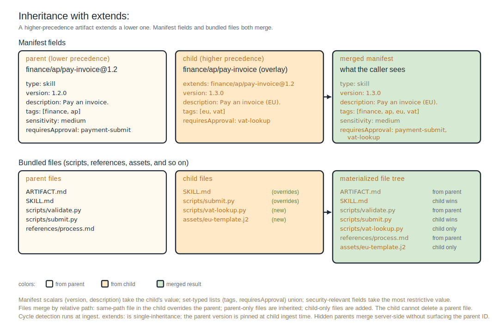

# Extends

When two layers contribute artifacts with the same canonical ID, ingest rejects the collision by default. The higher-precedence artifact can declare `extends:` in its frontmatter to inherit from the lower-precedence one and refine specific fields instead of forking.

```yaml
---
type: skill
name: pay-invoice
version: 2.0.0
extends: finance/ap/pay-invoice@1.x
description: Pay an approved invoice, with team-specific routing.
mcpServers:
  - name: finance-warehouse
    transport: stdio
    command: npx
    args: ["-y", "@team-foo/finance-warehouse-mcp"]
---

Team-specific addendum on top of the org-wide skill...
```

The merged artifact at request time has the parent's frontmatter and prose body composed with the child's; the merge rules are field-specific.

---

## Pinning

`extends:` accepts the same pin syntax as other artifact references:

| Syntax | Meaning |
|:--|:--|
| `<id>` | Resolves to `latest` at the child's ingest time, then pins. |
| `<id>@<semver>` | Exact version. |
| `<id>@<semver>.x` | Minor or patch range (e.g., `1.2.x`, `1.x`). |
| `<id>@sha256:<hash>` | Content-pinned. |

Parent version is resolved at the child's ingest time and stored as a hard pin in the ingested manifest's resolved form. Parent updates do not silently propagate; the child must be re-ingested (typically by bumping its `version:` and merging) to pick up changes.

---

## Field merge semantics

When the child declares `extends:`, fields merge per the table below. Author-specified fields on the child override or combine with the parent's per the rule.



<!--
ASCII fallback for the diagram above (inheritance with extends:):

  Manifest fields:

  parent (lower precedence)         child (higher precedence)         merged manifest
  finance/ap/pay-invoice@1.2        finance/ap/pay-invoice (overlay)  what the caller sees
  type: skill                       extends: finance/ap/...@1.2       type: skill           (parent)
  version: 1.2.0                    version: 1.3.0                    version: 1.3.0        (child)
  description: Pay an invoice.      description: Pay an invoice (EU). description: ...(EU). (child)
  tags: [finance, ap]               tags: [eu, vat]                   tags: [finance, ap,   (union)
  sensitivity: medium               requiresApproval: vat-lookup            eu, vat]
  requiresApproval: payment-submit                                    sensitivity: medium   (parent)
                                                                      requiresApproval:     (union)
                                                                        payment-submit, vat-lookup

  Bundled files (scripts/, references/, assets/, etc.):

  parent files                      child files                       materialized file tree
  ARTIFACT.md                       SKILL.md         (overrides)      ARTIFACT.md            (from parent)
  SKILL.md                          scripts/submit.py (overrides)     SKILL.md               (child wins)
  scripts/validate.py               scripts/vat-lookup.py (new)       scripts/validate.py    (from parent)
  scripts/submit.py                 assets/eu-template.j2 (new)       scripts/submit.py      (child wins)
  references/process.md                                               scripts/vat-lookup.py  (child only)
                                                                      references/process.md  (from parent)
                                                                      assets/eu-template.j2  (child only)

  Manifest scalars (version, description) take the child's value;
  set-typed lists (tags, requiresApproval) union; security-relevant
  fields take the most restrictive value. Files merge by relative
  path: same-path file in the child overrides the parent; parent-only
  files inherit; child-only files are added. The child cannot delete
  a parent file. Hidden parents merge server-side without surfacing
  the parent ID.
-->


| Field | Merge rule |
|:--|:--|
| `description`, `name`, `release_notes` | Scalar; child wins. |
| `tags` | List; append unique. |
| `when_to_use` | List; append. |
| `sensitivity` | Scalar; most-restrictive (high > medium > low). |
| `mcpServers` | List of objects; deep-merge by `name`. |
| `requiresApproval` | List; append. |
| `runtime_requirements` | Map; deep-merge with child wins. |
| `sandbox_profile` | Scalar; most-restrictive. |
| `delegates_to` | List; append. |
| `external_resources` | List; append. |
| `license` | Scalar; child wins (lint warning if changed across layers). |
| `search_visibility` | Scalar; most-restrictive (`direct-only` > `indexed`). |

**Default for unlisted fields.** A child can override any frontmatter field by setting it; if the child omits the field, the parent's value is inherited unchanged. This applies to `deprecated`, `replaced_by`, `effort_hint`, `model_class_hint`, `sbom`, `expose_as_mcp_prompt`, `rule_mode`, `rule_globs`, `rule_description`, `hook_event`, `hook_action`, `server_identifier`, `target_harnesses`, `input`, `output`, and any extension-type fields. The child's `type:` must match the parent's; ingest rejects an `extends:` chain that crosses types. The child's `version:` is independent; each artifact has its own version, and the parent version is pinned at the child's ingest time.

Extension types register their own merge semantics via `TypeProvider`.

The "most-restrictive" rules apply to security-relevant fields. A parent at `sensitivity: medium` cannot be relaxed to `low` by a child; a parent with `sandbox_profile: read-only-fs` cannot be widened to `unrestricted`.

---

## Bundled-file merge semantics

Bundled files (everything under the artifact root other than the manifest, including `scripts/`, `references/`, `assets/`, schemas, templates, and any other content) merge by relative path:

- A file at the same relative path in both parent and child resolves to the child's content. This applies to `SKILL.md` as well as bundled scripts and resources.
- A file only in the parent is inherited unchanged.
- A file only in the child is added.

The child cannot delete a parent file. To remove a file the parent contributes, the child must replace it with an empty file or shadow it at the same path with intentional content. The materialized package the caller receives is the merged union.

The content hash recorded for the merged artifact reflects the combined tree, so reproducibility holds across re-materialization as long as both parent and child versions are pinned.

---

## Constraints

- **Single inheritance.** `extends:` is a single scalar; no multiple inheritance. To compose from multiple parents, restructure the parents to chain (`A extends B; B extends C`).
- **Cycle detection.** Cycles in the `extends:` graph are detected at ingest time and rejected.
- **Same canonical ID.** A child uses `extends:` only when its canonical ID matches the parent's. The use case is a higher-precedence layer refining a lower-precedence layer's artifact at the same path. To override an artifact at a different path, write a new artifact at the new path and point references at it.
- **Re-ingest required for parent updates.** Parent version is pinned at the child's ingest time. Bumping the parent does not retroactively update the child's resolved manifest until the child is re-ingested.

---

## Replacing instead of extending

To replace a parent artifact entirely (rather than refine it), the lower-precedence layer must remove the parent first or rename the higher-precedence one. Silent shadowing is not permitted: ingest rejects same-ID collisions across layers when neither declares `extends:`.

This is the safety property that prevents an upper layer from quietly overwriting an org-wide artifact. Replacement is an explicit two-step operation: remove (or rename) the parent, then ingest the replacement.

---

## Hidden parents

When a child manifest declares `extends: <parent>` and the requesting identity cannot see the layer that contributes the parent, the registry resolves and merges the parent server-side and serves the merged manifest. The parent's existence and ID are not surfaced to the requester.

This preserves layer privacy across the inheritance chain. A team-shared layer can `extends:` an org-internal layer that the team can see; a contractor with access to the team layer (but not the org layer) sees the merged result without learning about the org layer's contents.

---

## Examples

### Refining a skill with team-specific MCP servers

The org-wide skill points at the org warehouse; the team-shared layer extends it to use a team-specific warehouse instead.

Org-wide layer:

```yaml
# layers/org-defaults/finance/ap/pay-invoice/SKILL.md
---
name: pay-invoice
description: Pay an approved invoice. Use after invoice approval to submit payment to the vendor.
license: MIT
---

Validate the invoice against the warehouse, then submit payment...
```

```yaml
# layers/org-defaults/finance/ap/pay-invoice/ARTIFACT.md
---
type: skill
version: 1.0.0
sensitivity: medium
mcpServers:
  - name: finance-warehouse
    transport: stdio
    command: npx
    args: ["-y", "@company/finance-warehouse-mcp"]
---

<!-- Skill body lives in SKILL.md. -->
```

Team-shared layer:

```yaml
# layers/team-foo/finance/ap/pay-invoice/SKILL.md
---
name: pay-invoice
description: Pay an approved invoice (team Foo). Use after invoice approval to submit payment with the team cost-center code.
license: MIT
---

Team-specific addendum: also tag payments with the team cost-center
code...
```

```yaml
# layers/team-foo/finance/ap/pay-invoice/ARTIFACT.md
---
type: skill
version: 2.0.0
extends: finance/ap/pay-invoice@1.x
mcpServers:
  - name: finance-warehouse
    transport: stdio
    command: npx
    args: ["-y", "@team-foo/finance-warehouse-mcp"]
---

<!-- Skill body lives in SKILL.md. -->
```

Merged result for a caller who can see both layers: child's `description`, `version`, prose body. `mcpServers` deep-merged by `name`, with the child's entry overriding the parent's (because the merge key matches). `sensitivity: medium` carried from the parent (most-restrictive between unset and `medium`).

### Tightening sandbox profile

A child can tighten security-relevant fields in `ARTIFACT.md` without redeclaring the rest:

```yaml
# layers/team-foo/platform/deploy-checks/ARTIFACT.md
---
type: skill
version: 2.0.0
extends: platform/deploy-checks@1.x
sandbox_profile: read-only-fs
---

<!-- Skill body lives in SKILL.md. -->
```

The parent's `sandbox_profile: unrestricted` is overridden by the child's `read-only-fs` (most-restrictive wins). The rest of the parent (description, prose body, tags, etc.) is unchanged.

---

## Lint behavior

- Unresolved parent at ingest time: lint warning rather than error. The child ingests with the `extends:` reference recorded; resolution happens at request time. (This handles "expected to be defined later" cases.)
- Cycle detected: ingest error.
- Child declaring `extends:` against a parent in a layer the child's layer cannot see: ingest succeeds; the parent resolves at request time per the visibility rules above.
- Child declaring `extends:` with a parent type that doesn't match the child's type: ingest error.

---

## Where to learn more

- [Frontmatter reference](frontmatter-reference) for the field-by-field schema.
