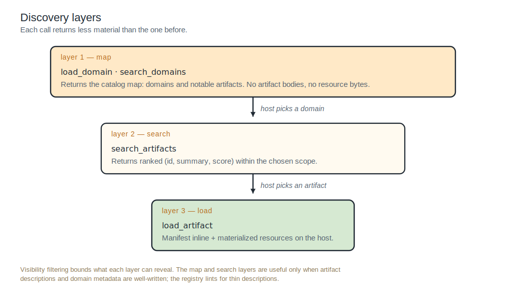
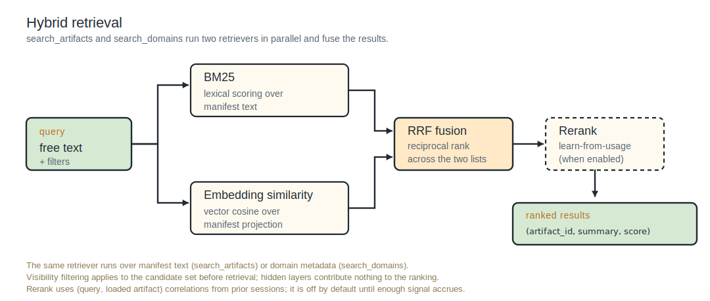

# Browsing the catalog

The Podium MCP server exposes a small set of meta-tools to harnesses that speak MCP. The agent uses them mid-session to discover and load capabilities incrementally, rather than starting with the full catalog in its context window.

The same operations are available to programmatic consumers via the SDK; this page focuses on the agent-mediated MCP path. SDK callers see the same wire format.

| Tool | Purpose |
|:--|:--|
| `load_domain(path?)` | Browse the catalog hierarchically. Returns a map of subdomains and notable artifacts. |
| `search_domains(query)` | Find candidate domain neighborhoods by query. |
| `search_artifacts(query?, scope?, type?, tags?)` | Find or browse artifacts by query and filters. |
| `load_artifact(id)` | Load a specific artifact's manifest and materialize bundled resources to disk. |

Discovery is staged: `load_domain` and the search tools are cheap (descriptors only); `load_artifact` is the expensive operation and the only one that writes to the host filesystem.



<!--
ASCII fallback for the diagram above (discovery layers):

  layer 1 — map
    load_domain · search_domains
    Returns the catalog map: domains and notable artifacts.
    No artifact bodies, no resource bytes.
                  |
                  v  (host picks a domain)
  layer 2 — search
    search_artifacts
    Returns ranked (id, summary, score) within the chosen scope.
                  |
                  v  (host picks an artifact)
  layer 3 — load
    load_artifact
    Returns the manifest inline and materializes resources on the host.

  Visibility filtering bounds what each layer can reveal. The map
  and search layers are useful only when artifact descriptions and
  domain metadata are well written.
-->

---

## `load_domain`

```
load_domain()                              → top-level domains
load_domain("finance")                     → finance's subdomains and notable artifacts
load_domain("finance/close-reporting")     → that subdomain's children
```

Returns:

- The requested domain's resolved description (long-form prose body if the domain has one, otherwise the frontmatter summary, otherwise a synthesized fallback).
- Author-supplied keywords for the domain.
- Notable artifacts (author `featured` plus learn-from-usage signal; empty when neither applies).
- Subdomains, each with their short description.

Output rendering (depth, folding, notable count, response budget) is governed by configurable rules per domain and per tenant. The agent can pass `depth` to override the configured default in one call.

When the renderer reduces the response (token-budget tightening or depth cap), the response includes a `note` field describing what was reduced. The agent can pass an explicit `depth` to push past it, drill into a specific subdomain, or fall back to `search_artifacts(scope=<path>)` for more notable artifacts than fit.

For authors: the [Domains page](../authoring/domains) covers the `DOMAIN.md` schema (descriptions, keywords, featured artifacts, discovery rendering knobs).

---

## `search_domains`

```
search_domains("vendor payments")
search_domains("observability", scope="platform")
```

Hybrid retrieval (BM25 + embeddings, fused via reciprocal rank) over each domain's projection (frontmatter `description` + `keywords` + truncated body). Returns ranked domain descriptors only: `path`, `name`, short `description`, `keywords`, score.

Use this when the agent doesn't know which domain to start in. The agent picks a result, calls `load_domain` on its path to drill in.

Filters: `scope` constrains to a path prefix (e.g., search only under `platform/`). `top_k` defaults to 10, max 50. Response includes `total_matched` so the caller knows when more results exist.

Domains without a `DOMAIN.md` aren't embedded and don't appear in `search_domains` results; they're reachable via `load_domain` enumeration only. Visibility filtering applies: a domain whose `DOMAIN.md` lives only in a layer the caller can't see won't surface.

---

## `search_artifacts`

```
search_artifacts("variance analysis", type="skill")
search_artifacts(scope="finance/ap")                         # browse mode
search_artifacts(query="invoice approval", scope="finance/ap", type="skill")
```

Hybrid retrieval over artifact frontmatter. All args optional:



<!--
ASCII fallback for the diagram above (hybrid retrieval):

  query (free text + filters)
       |
       +===> BM25 (lexical scoring over manifest text)        ===+
       |                                                         |==> RRF fusion ==> Rerank (optional) ==> ranked results
       +===> Embedding similarity (vector cosine over            +     (reciprocal       (learn-from-        (artifact_id,
              manifest projection)                                      rank across       usage; off          summary,
                                                                        the two lists)    by default)         score) tuples

  The same retriever runs over manifest text (search_artifacts)
  or domain metadata (search_domains). Visibility filtering
  applies to the candidate set before retrieval; hidden layers
  contribute nothing to the ranking.
-->


| Arg | Use |
|:--|:--|
| `query` | Free-text search target. Embedded and matched against the artifact projection (name, description, when_to_use, tags). |
| `type` | Filter by artifact type. |
| `tags` | Filter by tag. |
| `scope` | Constrain to a domain path prefix. |
| `top_k` | Result count cap. Default 10, max 50. |
| `session_id` | Optional UUID for `latest`-resolution consistency and learn-from-usage reranking. |

When `query` is omitted, returns artifacts matching the filters in default order. This is the canonical "list everything in this domain" move, useful when a domain's notable list and description don't tell the agent enough.

Returns ranked descriptors only. To use a result, call `load_artifact` with its id.

Response includes `total_matched` so the caller knows when more results exist than were returned. When more exist, the recovery options are: narrow with filters, drill into a subdomain, or run a more specific query.

---

## `load_artifact`

```
load_artifact("finance/close-reporting/run-variance-analysis")
load_artifact("finance/ap/pay-invoice", version="1.2.0")
```

Loads a specific artifact by ID. Returns the manifest body inline; bundled resources are materialized atomically on the host's filesystem at a host-configured destination path. Large blobs are delivered via presigned URLs that the MCP server fetches.

This is the expensive operation in the discovery flow. The agent calls it only when it has decided to use the artifact. Materialization runs through the configured harness adapter, so the on-disk layout matches what the harness expects.

Args:

- `id` (required)
- `version` (optional). Default is `latest`, resolved to the most recently ingested non-deprecated version visible to the caller.
- `session_id` (optional). The first `latest` lookup within a session is recorded and reused for all subsequent same-id lookups, so the host sees a consistent snapshot across the session.
- `harness` (optional). Per-call adapter override. Pass `none` to get the canonical layout regardless of the server's default `PODIUM_HARNESS`.

`mcp-server` artifacts are filtered out of MCP-bridge results by default: harnesses that consume Podium through the MCP bridge fix their MCP server list at startup, so a discovered `mcp-server` registration mid-session would only add planning noise. They remain visible through the SDK and through `podium sync`.

---

## Discovery flow

A typical session begins empty:

1. **Cold start.** The agent calls `load_domain()` to get the top-level map, or `search_domains(query)` when it knows the topic but not the right neighborhood.
2. **Drill in.** From a domain, drill further with `load_domain("<sub>")`, or jump to `search_artifacts(query, scope="<domain>")` if the request is specific enough.
3. **Browse if unclear.** When the domain's description and notable list don't tell the agent enough, `search_artifacts(scope="<path>")` with no query lists everything in the domain.
4. **Load.** Once the agent has chosen an artifact, `load_artifact(id)` materializes it.

Only `load_artifact` writes to the host filesystem. The catalog lives at the registry; the working set lives on the host.

---

## Latency and cost

The discovery layers are cheap; load is expensive. Per the SLO targets:

- `load_domain`: p99 < 200 ms
- `search_domains`: p99 < 200 ms
- `search_artifacts`: p99 < 200 ms
- `load_artifact` (manifest only): p99 < 500 ms
- `load_artifact` (manifest + bundled resources up to 10 MB): p99 < 2 s

Audit events are emitted for every call (`domain.loaded`, `domains.searched`, `artifacts.searched`, `artifact.loaded`). Free-text queries are PII-scrubbed before audit.

---

## Authoring affects discovery quality

What an agent finds (and doesn't) is largely a function of how authors describe their artifacts:

- **Artifact `description`** decides whether the harness reaches for the artifact at all. A specific description matches against actual user prompts; a vague one gets ignored.
- **Artifact `when_to_use`** is additional retrieval signal. Concrete situational triggers beat abstract framings.
- **Domain `description` + `keywords`** are the surface `search_domains` retrieves over. Without keywords, a domain may be unfindable for queries that don't use words from the description.
- **`featured` lists** in `DOMAIN.md` give domain owners explicit control over which artifacts surface first in `load_domain`'s notable list.

For authoring guidance, see [Your first artifact](../authoring/your-first-artifact) and [Domains](../authoring/domains).
