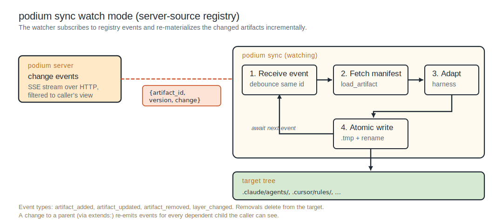
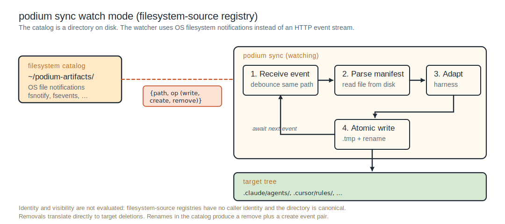

# Configure your harness

A harness can consume Podium artifacts in either of two ways. Pick one (or both) per harness:

- **Filesystem materialization** via `podium sync`. Writes harness-native files to disk; the harness's own filesystem discovery picks them up. Works against either a filesystem-source registry or a running Podium server. No runtime calls.
- **Runtime discovery** via the Podium MCP server. The agent calls `load_domain`, `search_domains`, `search_artifacts`, and `load_artifact` mid-session and materializes only what it needs. Requires a Podium server.

Most harnesses support both. Use the per-harness section below.

---

## Common pieces

The Podium MCP server is a stdio binary the harness spawns alongside its other MCP servers. The same env-var contract applies regardless of harness:

| Variable | Purpose |
|:--|:--|
| `PODIUM_REGISTRY` | Registry source: URL (server) or filesystem path. |
| `PODIUM_HARNESS` | Harness adapter to use. Pass `none` for canonical raw output. |
| `PODIUM_OVERLAY_PATH` | Optional. Workspace local-overlay path; falls back to `<workspace>/.podium/overlay/` when MCP roots resolve. |
| `PODIUM_IDENTITY_PROVIDER` | `oauth-device-code` (developer hosts, default) or `injected-session-token` (managed runtimes). |

For `podium sync`, the same configuration lives in `<workspace>/.podium/sync.yaml` (or `~/.podium/sync.yaml` for per-developer defaults). See the per-harness sections for examples.

`podium sync` runs in one-shot mode by default and in long-running watch mode when invoked with the watch flag. Watch mode subscribes to change events and re-materializes affected artifacts incrementally. The event source differs between server-source and filesystem-source registries; the downstream pipeline is identical.

**Server-source registry.** The watcher subscribes to a registry change-event stream (SSE over HTTP), filtered to the caller's effective view. The registry emits an event when an artifact in any visible layer is added, updated, or removed, or when a parent of a visible child changes.



<!--
ASCII fallback for the diagram above (podium sync watch mode, server-source registry):

  podium server                              podium sync (watching)
    change events       {artifact_id,         +-------------------+
    SSE stream over     version, change}      | 1. Receive event  |
    HTTP, filtered to   ===(event)===>        |    debounce by id |
    caller's view                             +---------+---------+
                                                        |
                                                        v
                                              +-------------------+
                                              | 2. Fetch manifest |
                                              |    load_artifact  |
                                              +---------+---------+
                                                        |
                                                        v
                                              +-------------------+
                                              | 3. Adapt          |
                                              |    harness writer |
                                              +---------+---------+
                                                        |
                                                        v
                                              +-------------------+
                                              | 4. Atomic write   |
                                              |    .tmp + rename  |
                                              +---------+---------+
                                                        |
                                                        v
                                              target tree:
                                                .claude/agents/, .cursor/rules/, ...

  After step 4 the watcher returns to step 1 (await next event).
  Event types: artifact_added, artifact_updated, artifact_removed,
  layer_changed. Removals delete from the target. A change to a
  parent re-emits events for every dependent child the caller
  can see.
-->

**Filesystem-source registry.** The catalog is a directory on disk. The watcher uses OS filesystem notifications (`fsnotify` on Linux and macOS, `ReadDirectoryChangesW` on Windows) and reads the changed manifests directly. Identity and visibility do not apply because the directory is canonical.



<!--
ASCII fallback for the diagram above (podium sync watch mode, filesystem-source registry):

  filesystem catalog                         podium sync (watching)
    ~/podium-artifacts/   {path, op           +-------------------+
    OS file notifications  (write, create,    | 1. Receive event  |
    (fsnotify / fsevents   remove)}           |    debounce path  |
     / ReadDirChanges)   ===(event)===>       +---------+---------+
                                                        |
                                                        v
                                              +-------------------+
                                              | 2. Parse manifest |
                                              |    read from disk |
                                              +---------+---------+
                                                        |
                                                        v
                                              +-------------------+
                                              | 3. Adapt          |
                                              |    harness writer |
                                              +---------+---------+
                                                        |
                                                        v
                                              +-------------------+
                                              | 4. Atomic write   |
                                              |    .tmp + rename  |
                                              +---------+---------+
                                                        |
                                                        v
                                              target tree:
                                                .claude/agents/, .cursor/rules/, ...

  Removals translate directly to target deletions. Renames in the
  catalog produce a remove and create event pair. Identity and
  visibility are not evaluated: filesystem-source registries have
  no caller identity.
-->


---

## Supported harnesses

The harnesses below ship with a built-in adapter. For per-harness specifics about skills, hooks, plugins, and other harness-native concepts, refer to the harness's own documentation; the harness's documentation is the source of truth.

| Adapter value    | Harness | Documentation |
|:-----------------|:--------|:--------------|
| `none`           | Generic / raw output. No harness-specific translation. | n/a |
| `claude-code`    | Anthropic Claude Code (CLI). | [code.claude.com/docs](https://code.claude.com/docs/) |
| `claude-desktop` | Anthropic Claude Desktop (desktop chat app). | [claude.com/download](https://claude.com/download), [Skills in Claude](https://support.claude.com/en/articles/12512180-use-skills-in-claude) |
| `claude-cowork`  | Anthropic Claude Cowork (web product for organizations, claude.ai). | [claude.com/plugins](https://claude.com/plugins), [Manage Cowork plugins](https://support.claude.com/en/articles/13837433-manage-claude-cowork-plugins-for-your-organization) |
| `cursor`         | Cursor IDE. | [cursor.com/docs](https://cursor.com/docs) |
| `codex`          | OpenAI Codex (CLI and IDE). | [developers.openai.com/codex](https://developers.openai.com/codex) |
| `gemini`         | Google Gemini CLI. | [geminicli.com/docs](https://geminicli.com/docs) |
| `opencode`       | OpenCode. | [opencode.ai/docs](https://opencode.ai/docs) |
| `pi`             | Pi (pi-mono coding agent). | [github.com/badlogic/pi-mono](https://github.com/badlogic/pi-mono/tree/main/packages/coding-agent) |
| `hermes`         | Hermes Agent (Nous Research). | [hermes-agent.nousresearch.com/docs](https://hermes-agent.nousresearch.com/docs/) |

The adapter set grows as new harnesses appear. Custom adapters register through the `HarnessAdapter` SPI; see [Extending](../deployment/extending).

---

## Claude Code

**MCP server** (project-level `.mcp.json` at the repository root, or user-level `~/.claude.json`; `claude mcp add` writes either):

```json
{
  "mcpServers": {
    "podium": {
      "command": "podium-mcp",
      "env": {
        "PODIUM_REGISTRY": "https://podium.acme.com",
        "PODIUM_HARNESS": "claude-code",
        "PODIUM_OVERLAY_PATH": "${WORKSPACE}/.podium/overlay/"
      }
    }
  }
}
```

**`podium sync`**:

```bash
cd your_workspace
podium init --registry ~/podium-artifacts/ --harness claude-code
podium sync
```

**Where artifacts land:**

| Type | Location |
|:--|:--|
| `skill` | `.claude/skills/<name>/SKILL.md` (folder per skill, agentskills.io layout) |
| `agent` | `.claude/agents/<name>.md` |
| `rule` | `.claude/rules/<name>.md` (optional `paths:` frontmatter for path-scoping) |
| `command` | `.claude/commands/<name>.md` |
| `hook` | Merged into `.claude/settings.json` under the `hooks` key, keyed by the artifact ID so a re-sync reconciles only Podium's entries. A hook's bundled scripts materialize to `.podium/resources/<artifact-id>/`, and the merged command references them there. |
| `context` | No native Claude Code concept. A `context` artifact lands at `.podium/context/<artifact-id>/`; reference material that belongs to a skill ships in that skill's `references/`. |
| `mcp-server` | Merged into `.mcp.json` (project root) under `mcpServers`, keyed by the artifact ID. |
| Bundled resources | Inside the skill folder (`scripts/`, `references/`, `assets/`). |

**Notes:**

- The rule file carries the prose with the Podium-internal fields dropped. `always` loads at launch and `glob` writes the native `paths:` YAML list, both fully supported. `auto` and `explicit` fall back to a load-always file and draw a lint warning, because `.claude/rules/` files have no description-attach or mention-only mode (a rule without `paths:` loads on every turn).
- Native hook system available; see [Hooks](../authoring/hooks).

---

## Claude Desktop

**MCP server** (`~/Library/Application Support/Claude/claude_desktop_config.json` on macOS; equivalents on Windows/Linux):

```json
{
  "mcpServers": {
    "podium": {
      "command": "podium-mcp",
      "env": {
        "PODIUM_REGISTRY": "https://podium.acme.com",
        "PODIUM_HARNESS": "claude-desktop"
      }
    }
  }
}
```

**`podium sync`** has no project-level surface for Claude Desktop. Claude Desktop is a chat application whose only on-disk install points are the user/OS-scope MCP config above (`claude_desktop_config.json`) and Desktop Extension bundles (`.mcpb`); it has no native concept for `skill`, `agent`, `context`, `command`, `rule`, or `hook`, and it does not read project-level artifact files. Register the Podium MCP server (above) for runtime discovery, or package an MCP server as a `.mcpb` bundle. For on-disk materialization of other artifact types, target a coding harness instead.

**Notes:**

- Only `mcp-server` has a Claude Desktop home, and it is user/OS-scope. Other artifact types are `✗` for this harness; exclude it with `target_harnesses:` or use a coding harness for materialization.

---

## Claude Cowork

Cowork is Anthropic's web product for organizations (claude.ai). Plugin distribution to Cowork uses a private Git-hosted plugin marketplace that an org admin imports.

**`podium sync`** writes a Claude Cowork plugin marketplace: a `.claude-plugin/marketplace.json` at the repository root, and each plugin under `plugins/<plugin>/` with a `.claude-plugin/plugin.json` manifest. Inside a plugin, components use the Claude Code plugin layout: `skills/<name>/SKILL.md`, `agents/<name>.md`, `commands/<name>.md`, `hooks/hooks.json`, and `.mcp.json`. Plugins have no native `rule` or `context` component, so those types ship as skills (`skills/<name>/SKILL.md`). The output tree is intended to be committed to a private Git repository that the org admin imports as a private marketplace.

```bash
podium sync --harness claude-cowork --target ./cowork-marketplace/
git -C ./cowork-marketplace/ add . && git -C ./cowork-marketplace/ commit -m "Sync from Podium"
git -C ./cowork-marketplace/ push
```

The org admin then imports the repo URL via [Manage Cowork plugins](https://support.claude.com/en/articles/13837433-manage-claude-cowork-plugins-for-your-organization).

**MCP server** is not applicable: Cowork ingests plugins via its private-marketplace flow rather than spawning local MCP servers per session. Use `podium sync` to publish, and Cowork's own admin tools to deploy.

**Notes:**

- Cowork inherits Claude Code's plugin format; skills follow the same `SKILL.md` standard.
- Org admins control which plugins reach which users via Cowork's per-user provisioning.

---

## Cursor

**MCP server** (Settings → MCP, or `~/.cursor/mcp.json`):

```json
{
  "mcpServers": {
    "podium": {
      "command": "podium-mcp",
      "env": {
        "PODIUM_REGISTRY": "https://podium.acme.com",
        "PODIUM_HARNESS": "cursor"
      }
    }
  }
}
```

**`podium sync`**:

```bash
cd your_workspace
podium init --registry ~/podium-artifacts/ --harness cursor
podium sync
```

**Where artifacts land:**

| Type | Location |
|:--|:--|
| `rule` | `.cursor/rules/<name>.mdc` with `alwaysApply` / `globs` / `description` set per `rule_mode`. |
| `skill` | `.cursor/skills/<name>/SKILL.md` (folder per skill, with `SKILL.md`). |
| `agent` | `.cursor/agents/<name>.md` |
| `command` | `.cursor/commands/<name>.md` |
| `hook` | Merged into `.cursor/hooks.json` under the `hooks` key. `.cursor/hooks/` holds only the scripts a hook entry references. |
| `mcp-server` | Merged into `.cursor/mcp.json` under `mcpServers`. |
| `context` | No native Cursor concept (`@Docs` is URL-indexed). A `context` artifact lands at `.podium/context/<artifact-id>/`. |

**Notes:**

- Cursor has the most complete `rule_mode` support: all four values map natively to the `.mdc` frontmatter.
- Native hook system available.

---

## OpenCode

**MCP server** (`opencode.json` at the project root or `~/.config/opencode/opencode.json`):

```json
{
  "mcpServers": {
    "podium": {
      "command": "podium-mcp",
      "env": {
        "PODIUM_REGISTRY": "https://podium.acme.com",
        "PODIUM_HARNESS": "opencode"
      }
    }
  }
}
```

**`podium sync`**:

```bash
cd your_workspace
podium init --registry ~/podium-artifacts/ --harness opencode
podium sync
```

**Where artifacts land:**

OpenCode uses plural component directories (`.opencode/agents/`, `.opencode/commands/`, `.opencode/skills/`) and centers rules on `AGENTS.md`. OpenCode has no `.opencode/rules/` directory.

| Type | Location |
|:--|:--|
| `skill` | `.opencode/skills/<name>/SKILL.md` (folder per skill). |
| `agent` | `.opencode/agents/<name>.md` |
| `command` | `.opencode/commands/<name>.md` (supports `$ARGUMENTS` and positional `$1`/`$2`). |
| `rule` | Injected into `AGENTS.md` between Podium-managed XML markers (project-root, or common-ancestor for `rule_mode: glob`). Extra files referenced via the `instructions` array in `opencode.json`. |
| `mcp-server` | Merged into `opencode.json` under the `mcp` key. |
| `hook` | No declarative file. OpenCode hooks are JavaScript or TypeScript plugin modules (`.opencode/plugins/<name>.ts`), so `hook` artifacts are not materialized; exclude OpenCode with `target_harnesses:`. |
| `context` | No native concept. A `context` artifact lands at `.podium/context/<artifact-id>/`. |

**Notes:**

- `rule_mode: auto` is not supported; ingest fails with a lint error unless `target_harnesses:` excludes opencode.
- Custom instruction files in `opencode.json` can reference Podium-materialized files; useful for explicit-mode rules.
- AGENTS.md takes precedence over CLAUDE.md when both exist.

---

## Codex

**MCP server**: configure per OpenAI Codex's MCP config conventions. The env-var contract is the same as the other harnesses; pass `PODIUM_HARNESS=codex`.

**`podium sync`**:

```bash
cd your_workspace
podium init --registry ~/podium-artifacts/ --harness codex
podium sync
```

**Where artifacts land:**

Codex consumes `AGENTS.md` for rules and now has native skill, subagent, and hook surfaces.

| Type | Location |
|:--|:--|
| `skill` | `.agents/skills/<name>/SKILL.md` (folder per skill; note the `.agents/` root, not `.codex/`). |
| `agent` | `.codex/agents/<name>.toml` |
| `rule` | Injected into root `AGENTS.md` (or common-ancestor for `rule_mode: glob`) between Podium-managed markers. |
| `hook` | Merged into `.codex/hooks.json` (or `.codex/config.toml` `[hooks]`). |
| `mcp-server` | Merged into `.codex/config.toml` under `[mcp_servers]`. |
| `command` | No project-level target. Codex custom prompts are user-scope (`~/.codex/prompts/`) and deprecated in favor of skills; exclude Codex with `target_harnesses:` or author as `type: skill`. |
| `context` | No native concept. A `context` artifact lands at `.podium/context/<artifact-id>/`. |

**Notes:**

- `rule_mode: auto` is not supported; ingest fails with a lint error.
- Codex has a native hook surface (`.codex/hooks.json` or `[hooks]` in `config.toml`), so `hook` artifacts materialize rather than failing ingest.
- Skills live at `.agents/skills/`, not `.codex/skills/`. Subagents are TOML at `.codex/agents/<name>.toml`.

---

## Gemini

**MCP server**: configure per the Gemini CLI's MCP config conventions. Pass `PODIUM_HARNESS=gemini`.

**`podium sync`**:

```bash
cd your_workspace
podium init --registry ~/podium-artifacts/ --harness gemini
podium sync
```

**Where artifacts land:**

| Type | Location |
|:--|:--|
| `skill` | `.gemini/skills/<name>/SKILL.md` (folder per skill). |
| `agent` | `.gemini/agents/<name>.md` |
| `command` | `.gemini/commands/<name>.toml` (TOML with a `prompt` key; `{{args}}` for arguments). |
| `rule` | Injected into `GEMINI.md` (the hierarchical context file) between Podium-managed markers. |
| `hook` | Merged into `.gemini/settings.json` under the `hooks` key. |
| `mcp-server` | Merged into `.gemini/settings.json` under `mcpServers`. |
| `context` | `.podium/context/<artifact-id>/` (harness-neutral; reference material that belongs to a skill ships in that skill's `references/`). |

**Notes:**

- `rule_mode: always` maps to `GEMINI.md`. Other rule modes fall back with a lint warning per the per-harness capability matrix.
- Gemini commands are TOML and use the `{{args}}` placeholder; positional arguments are not supported.
- See [Rule modes](../authoring/rule-modes) for the per-harness mapping.

---

## Pi

**MCP server**: not applicable. Pi deliberately omits MCP, so the Podium MCP server cannot run inside Pi. Use `podium sync` for filesystem materialization.

**`podium sync`**:

```bash
cd your_workspace
podium init --registry ~/podium-artifacts/ --harness pi
podium sync
```

**Where artifacts land:**

Pi loads `AGENTS.md` from the project tree (and `~/.pi/agent/AGENTS.md` globally). Pi deliberately omits subagents, hooks, and MCP, so those types have no native surface. There is no native `.pi/rules/` directory in core Pi.

| Type | Location |
|:--|:--|
| `skill` | `.pi/skills/<name>/SKILL.md` (folder per skill). |
| `command` | `.pi/prompts/<name>.md` (Pi calls these prompt templates; supports `$1`/`$@`/`{{var}}`). |
| `rule` | Injected into root `AGENTS.md` between Podium-managed markers. |
| `agent`, `hook`, `mcp-server` | Not supported. Pi omits subagents, on-disk hooks, and MCP; exclude Pi with `target_harnesses:`. |
| `context` | No native concept. A `context` artifact lands at `.podium/context/<artifact-id>/`. |

**Notes:**

- `rule_mode: auto` is not supported.
- Pi also reads `SYSTEM.md` and `APPEND_SYSTEM.md` for system-prompt customization; Podium does not write to these by default.

---

## Hermes

**MCP server** (`~/.hermes/config.yaml` under the `mcp_servers:` key; YAML, not JSON):

```yaml
# ~/.hermes/config.yaml
mcp_servers:
  podium:
    command: podium-mcp
    env:
      PODIUM_REGISTRY: https://podium.acme.com
      PODIUM_HARNESS: hermes
```

**`podium sync`**:

```bash
cd your_workspace
podium init --registry ~/podium-artifacts/ --harness hermes
podium sync
```

**Where artifacts land:**

Hermes natively reads project-level `.cursor/rules/*.mdc`, root `AGENTS.md`, and `.cursorrules`. Its own skill, command, hook, and MCP surfaces live under user-scope `~/.hermes/`, which project-level materialization does not write, so those types are out of scope for sync.

| Type | Location |
|:--|:--|
| `rule` | `.cursor/rules/<name>.mdc` (reused from the Cursor format) or root `AGENTS.md`. |
| `context` | `.podium/context/<artifact-id>/` (harness-neutral). |
| `skill`, `command`, `hook`, `mcp-server` | User-scope only (`~/.hermes/skills/`, `~/.hermes/config.yaml`, and similar). Not materialized at project level; exclude Hermes with `target_harnesses:` or configure these out of band. |

**Notes:**

- Hermes has the broadest rule-format compatibility of any harness Podium supports; all `rule_mode` values map cleanly via the cursor-style `.mdc` format.

---

## Generic / `none`

For runtimes without a dedicated adapter, or when canonical raw output is needed, set `PODIUM_HARNESS=none`. The MCP server and `podium sync` write the canonical layout as-is, with no harness-specific translation and no field renaming. Consumers such as runtimes, eval harnesses, and custom tooling read `ARTIFACT.md` (and `SKILL.md` for skills) plus bundled resources directly.

```json
{
  "mcpServers": {
    "podium": {
      "command": "podium-mcp",
      "env": {
        "PODIUM_REGISTRY": "https://podium.acme.com",
        "PODIUM_HARNESS": "none"
      }
    }
  }
}
```

```bash
podium init --registry ~/podium-artifacts/ --harness none
podium sync
```

This is also the right harness for build pipelines and evaluation harnesses that need the canonical artifact bytes without translation.

---

## Standalone (no env override)

When `podium serve` has auto-bootstrapped `~/.podium/sync.yaml` with `defaults.registry: http://127.0.0.1:8080`, or `podium init --global --standalone` has written it explicitly, the MCP server resolves the registry from there and the `PODIUM_REGISTRY` env var can be omitted. The harness still needs `PODIUM_HARNESS` set (or `--harness <name>` on the sync command).

---

## Capability matrix

[Rule modes](../authoring/rule-modes) has the per-harness mapping for `rule_mode` values.
