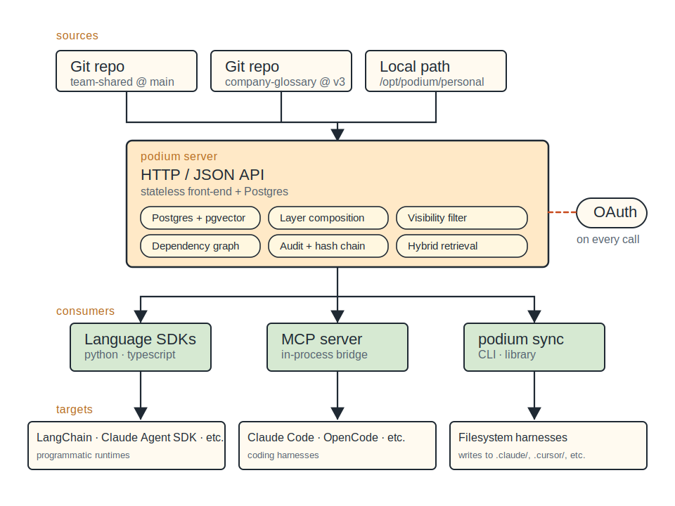
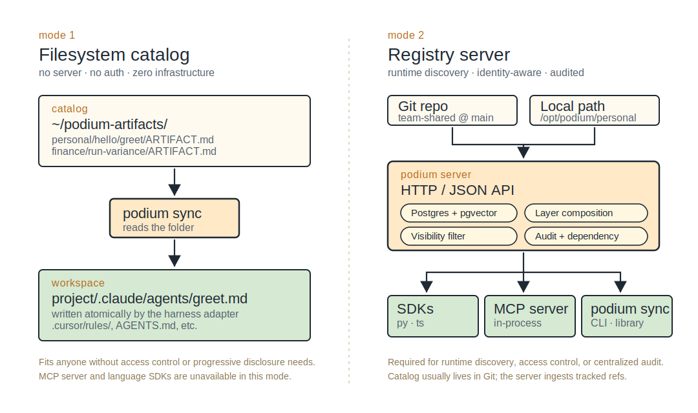
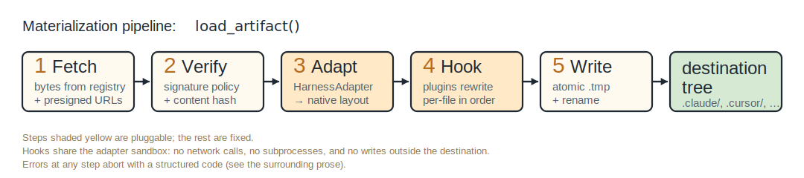

# How it works

Podium has two main parts:

- A **registry**: the system of record for artifacts.
- **Consumers**: components that read from the registry. Built-in
  consumers include language SDKs, the MCP server, and `podium sync`.
  Custom consumers can build against the HTTP API.

The registry can be reached as a Podium server (single binary or
multi-tenant deployment) or as a local filesystem path. Most
consumers work against a server; `podium sync` also works
against a filesystem registry directly.

---

## High-level architecture

The registry stores the catalog. Consumers retrieve artifacts and translate
them into the format expected by the harness.

Server mode is what most teams run once they're past the filesystem
stage. The server holds the catalog; consumers reach it over HTTP
and identity-aware composition runs server-side:

<!--
ASCII fallback for the diagram above (server-mode architecture):

  sources:
    Git repo            Git repo                 Local path
    team-shared @ main  company-glossary @ v3    /opt/podium/personal
         |                  |                       |
         +------------------+-----------------------+
                                  |
                                  v
                  +-----------------------------------+
                  | podium server                     |
                  |   HTTP / JSON API                 |   OAuth identity
                  |   stateless front-end + Postgres  | --- on every call
                  |                                   |
                  |   [Postgres + pgvector]           |
                  |   [Layer composition]             |
                  |   [Visibility filter]             |
                  |   [Dependency graph]              |
                  |   [Audit + hash chain]            |
                  |   [Hybrid retrieval]              |
                  +-----------------+-----------------+
                                    |
            +-----------------------+-----------------------+
            v                       v                       v
       +-----------+           +-----------+           +-------------+
       | Language  |           | MCP       |           | podium sync |
       | SDKs      |           | server    |           | CLI library |
       | py / ts   |           | in-proc   |           |             |
       +-----------+           +-----------+           +-------------+
            |                       |                       |
            v                       v                       v
       targets:
       LangChain, Bedrock,    Claude Code, Cursor,    Filesystem
       programmatic runtimes  Codex, Cowork, Pi, ..   harnesses
                                                      (.claude/, .cursor/, ..)
-->

Filesystem mode is for solo work, prototypes, and CI. The catalog is
a folder; `podium sync` reads it directly. The diagram below shows
the two modes side by side:

<!--
ASCII fallback for the diagram above (filesystem vs server mode):

  Filesystem mode                       |  Server mode
                                        |
  catalog:                              |   Git repo            Local path
    ~/podium-artifacts/                 |   team-shared @ main  /opt/podium/personal
      personal/hello/greet/ARTIFACT.md  |        |                   |
      finance/run-variance/ARTIFACT.md  |        +---------+---------+
              |                         |                  |
              v                         |                  v
       +----------------+               |     +-------------------------+
       | podium sync    |               |     | podium server           |
       | reads directly |               |     |   HTTP / JSON API       |
       +-------+--------+               |     |   Postgres + pgvector   |
               |                        |     |   Layer composition     |
               v                        |     |   Visibility filter     |
  workspace:                            |     |   Audit + dependency    |
    project/.claude/agents/greet.md     |     +------------+------------+
    .cursor/rules/, AGENTS.md, etc.     |             +----+----+
                                        |             v    v    v
                                        |          SDKs  MCP  podium sync
                                        |               server

  Fits any team or individual without   |  Required for runtime discovery,
  access control or progressive         |  access control, or centralized
  disclosure needs. MCP server and      |  audit. Catalog usually lives in
  language SDKs require a server;       |  Git; the server ingests tracked
  not available in this mode.           |  refs.
-->

The artifacts, the file formats (`ARTIFACT.md`, `SKILL.md`, and
`DOMAIN.md`), and the harness adapter behavior are identical across
modes. `podium sync` either reaches the registry over HTTP or reads it
directly from disk. The MCP server and language SDKs require a server.

---

## What runs where

For server-source deployments:

| Component        | Role                                                                                                                           | Where it runs                                                                                                                      |
| :--------------- | :----------------------------------------------------------------------------------------------------------------------------- | :--------------------------------------------------------------------------------------------------------------------------------- |
| Registry service | HTTP API; layer composition; visibility filtering; manifest indexing; hybrid retrieval; dependency graph; signing; audit       | A server (single binary in standalone mode; replicated behind a load balancer in standard mode)                                    |
| Postgres         | Manifest metadata, layer config, admin grants, dependency edges, audit log, embeddings (when `pgvector` is the vector backend) | Alongside the registry (or managed RDS / Cloud SQL / Aurora)                                                                       |
| Object storage   | Bundled resource bytes, content-addressed                                                                                      | S3 / GCS / MinIO / R2 (filesystem in standalone mode)                                                                              |
| Vector backend   | Hybrid retrieval                                                                                                               | `pgvector` and `sqlite-vec` collocate with the metadata store; managed alternatives include Pinecone, Weaviate Cloud, Qdrant Cloud |
| MCP server       | In-process bridge for MCP-speaking hosts; runs the harness adapter at materialization time                                     | Spawned as a stdio subprocess by the host (Claude Code, Cursor, etc.), one per workspace                                           |
| `podium sync`    | Eager filesystem materialization; one-shot or watcher                                                                          | Developer machines, CI runners, build pipelines                                                                                    |
| Language SDKs    | Programmatic HTTP clients                                                                                                      | Wherever your code runs: LangChain, Bedrock, OpenAI Assistants, custom orchestrators, eval harnesses                               |

The MCP server, `podium sync`, and the language SDKs share the same
registry HTTP API. They also share identity providers, the content
cache, layer composition, and the harness adapter. The MCP server
and `podium sync` are thin clients that delegate composition and
visibility to the registry, then run the adapter and write to disk
locally.

For filesystem-source deployments, only `podium sync` and the
filesystem-aware shared library are involved. There is no Postgres,
no object storage, no authentication, and no registry process.

---

## Deployment modes

These labels appear throughout the docs. Pick the one that fits
today; graduate when you outgrow it.

### Filesystem

A directory of files, with no daemon and no authentication.
`podium sync` reads the directory directly, applies layer
composition and the harness adapter, and writes to your harness's
destination.

- **Who it's for.** Any team or individual whose catalog does not
  require access control or progressive disclosure. Solo workflows
  keep the directory local; teams commit it to Git and every
  developer runs `podium sync` against their clone.
- **What you run.** Just the `podium` CLI.
- **What you get.** Eager materialization. The harness's own
  filesystem discovery does the loading at runtime.
- **Unavailable in this mode.** Lazy discovery via MCP or SDK,
  centralized audit, and identity-based visibility filtering.
- **Multi-user.** Share the directory however you'd share any
  folder. Committing to git is the typical choice; the git history
  doubles as the audit trail and `git pull` is each developer's
  ingest. A network share or a sync service (Dropbox, iCloud, etc.)
  also works.

### Standalone server

A single binary running on one machine. SQLite + sqlite-vec +
filesystem object storage + a bundled embedding model, all
embedded. Bind to localhost or behind your VPN.

- **Who it's for.** Anyone of any team size who specifically wants
  runtime discovery (agents calling MCP meta-tools mid-session) or
  a single audit log without standing up the full standard stack.
  Most small teams can stay in filesystem mode until runtime discovery
  or centralized audit becomes necessary.
- **What you run.** `podium serve --standalone --layer-path
/path/to/dir` plus the CLI.
- **What you get.** Runtime discovery via the MCP server. A single
  audit log capturing every load. Semantic search.
- **Migration path.** Point `podium serve --standalone` at the same
  directory your filesystem catalog uses; flip
  `defaults.registry` from a path to a URL. Authoring loop
  unchanged.

### Standard

The standard deployment uses Postgres, pgvector, S3, OIDC, and
multi-tenancy.
Helm chart ships with the registry; supporting services are managed
or self-run alongside.

- **Who it's for.** Larger teams and organizations. Multi-tenant
  deployments, governed environments, anything with compliance
  constraints or identity-based visibility requirements.
- **What you run.** Registry replicas behind a load balancer,
  Postgres (managed or self-run), object storage, an OIDC IdP. See
  [Deployment → Operator guide](../deployment/operator-guide).
- **What you get.** Per-layer visibility, freeze windows, signing,
  hash-chained audit, SCIM, multi-tenancy.
- **Migration path.** `podium admin migrate-to-standard` exports
  from a standalone deployment to a standard one; the same artifact
  directory becomes a `local`-source layer until you cut over to
  Git-source layers.

---

## Where state lives

State lives in the locations below. Each mode uses a different
combination.

| State                                  | Filesystem                                                                         | Standalone                                   | Standard                                                                              |
| :------------------------------------- | :--------------------------------------------------------------------------------- | :------------------------------------------- | :------------------------------------------------------------------------------------ |
| Manifest metadata, layer config, audit | (none; directory is canonical)                                                     | SQLite (`~/.podium/standalone/podium.db`)    | Postgres                                                                              |
| Embeddings                             | (none)                                                                             | sqlite-vec collocated in SQLite              | pgvector collocated in Postgres (or external: Pinecone, Weaviate Cloud, Qdrant Cloud) |
| Bundled resource bytes                 | The directory itself                                                               | Filesystem (`~/.podium/standalone/objects/`) | S3-compatible object storage                                                          |
| Workspace local overlay                | `<workspace>/.podium/overlay/` (highest precedence in the caller's effective view) |
| Content cache                          | `~/.podium/cache/` (content-addressed; shared across workspaces)                   |
| Sync state                             | `<target>/.podium/sync.lock` (per-target)                                          |

The workspace overlay, content cache, and sync state are
client-side; they exist regardless of which deployment mode the
registry uses.

---

## Materialization

A consumer calls `load_artifact(id, harness=...)`. The pipeline
fetches bundled bytes from the registry, verifies them against the
manifest's signature and content hash, runs the configured
`HarnessAdapter` to translate the canonical layout into the
harness-native one, applies any `MaterializationHook` plugins, and
writes atomically to the destination. Errors at any step abort with
a structured code so the caller can decide whether to retry, fall
back, or surface a diagnostic.

<!--
ASCII fallback for the diagram above (materialization pipeline: load_artifact()):

  [1. Fetch]   ==> [2. Verify]   ==> [3. Adapt]    ==> [4. Hook]    ==> [5. Write]   ==> destination tree
   bytes from       signature         Harness            plugins           atomic .tmp      .claude/, .cursor/, ..
   registry         policy            Adapter ->         rewrite           + rename
   + presigned      + content         native             per-file
   URLs             hash              layout             in order

  Steps 3 (Adapt) and 4 (Hook) are pluggable; the rest are fixed. Hooks share the
  adapter sandbox: no network calls, no subprocesses, and no writes outside the
  destination. Errors at any step abort with a structured code (see surrounding prose).
-->

`HarnessAdapter` and `MaterializationHook` are the pluggable steps.
The remaining steps are fixed. Hooks share the adapter sandbox:
they cannot make network calls, spawn subprocesses, or write
outside the destination.

---

## Shared library code

The manifest parsers, glob resolver, layer composer, `extends:`
resolver, visibility evaluator, materialization writer, and harness
adapters all live in a single Go module. The registry binary embeds it
behind the HTTP API. `podium sync` in filesystem mode calls the same
module functions directly, skipping HTTP. The MCP server and
`podium sync` in server-source mode are thin HTTP clients that invoke the
same module's materialization writer locally.

There is a single canonical implementation per concern. Migrating
between deployment modes (filesystem → standalone → standard)
preserves behavior because the same composer, parsers, merge
semantics, and harness adapter output run in every mode.

The language SDKs are the exception: they're independent HTTP
clients in Python and TypeScript, and they only work against a
Podium server.

---

## Identity and trust

The registry attaches an OAuth-attested identity to every call.
Built-in identity providers:

- **`oauth-device-code`**: interactive device-code flow for
  developer hosts; tokens cached in the OS keychain.
- **`injected-session-token`**: runtime-issued signed JWT for
  managed agent runtimes (Bedrock Agents, OpenAI Assistants, custom
  orchestrators). The runtime registers its signing key once with
  the registry; the registry verifies signatures on every call.

Filesystem-source registries don't have identity by definition:
the visibility evaluator short-circuits to `true` for every layer.
Standalone deployments can run with or without auth; with auth,
they use the same OIDC machinery as standard deployments.

`tenant.expose_scope_preview` lets operators decide whether
aggregate visibility counts (artifact count, by-type, by-sensitivity)
are exposed to callers, which is useful for tenants where even those
aggregates would leak signal.

---

## Versioning

Versions are semver, author-chosen via the manifest's `version:`
field. Once `(artifact_id, version)` is ingested, it's bit-for-bit
immutable forever in the registry's content store. Subsequent
commits to the same version with different content are rejected at
ingest. References can pin exact versions
(`@1.2.3`), minor / patch ranges (`@1.2.x`, `@1.x`), or content
hashes (`@sha256:abc...`).

`load_artifact(id)` without a version pin resolves to the most
recently ingested non-deprecated version visible to the caller. For
session consistency, the meta-tools accept a `session_id` argument:
the first `latest` lookup within a session is recorded and reused
for every subsequent same-id lookup, so the host sees a consistent
snapshot.

---

## What's next

After the vocabulary and architecture, continue with the role-specific
guide that fits the task:

- **Authoring artifacts**: [Authoring guide](../authoring/)
- **Using them in a harness**: [Consuming guide](../consuming/)
- **Setting up Podium for a team or org**: [Deployment guide](../deployment/)
- **Calling the API directly**: [Reference](../reference/)
